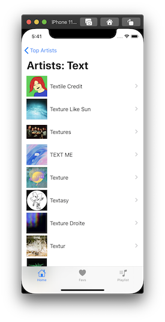
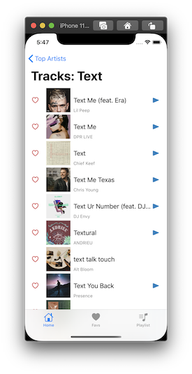

# SpotiFav
An iOS app to authenticate as well as perform GET and POST calls to the [Spotify Web API](https://developer.spotify.com/documentation/web-api/)

## Description
This app authenticates to the [Spotify Web API](https://developer.spotify.com/documentation/web-api/) using the user's Spotify credentials. Once logged in they are provided with an access token that is then used by the app to perform various network calls. Additionally, songs can be saved locally to a user's favorite songs list.

### Features
* Authenticates to the Spotify Web API to enable API calls
* POST calls to get access token from access code or refresh token
* Various GET calls for [Spotify endpoints](https://developer.spotify.com/documentation/web-api/reference/)
    * GET user's top artists
    * GET user's top tracks
    * GET Global Top 50 tracks via playlist
* Handles expired access token, so users don't have to reauthenticate when token expires
* Audio preview tracks using AVFoundation with pause and resume functionality
* Uses GCD(Grand Central Dispatch) to improve user experience 
* Uses custom network layer to perform network calls.
* Search for Artists or Tracks from Spotify

### App Screenshots
  
 

### Usage
Tap "Auth Spotify" and once prompted provide your email and password for Spotify to authenticate and to fetch your top artists, top songs, see the world's current top 50 songs, or preform search functions. 

Tap on the heart image to either favorite or remove a song as a favorite. 

Tap anywhere else on the cell to hear a preview of the song only  if there's a play button to the right (not all songs are previewable). 

### Run Locally
Project code can be viewed locally and run in Xcode's simulator by cloning or downloading this [repo](https://github.com/caocmai/spotiFav).

## Built With
* [Xcode - 11.3.1](https://developer.apple.com/xcode/) - The IDE used
* [Swift - 5.1.4](https://developer.apple.com/swift/) - Programming language
* [Kingfisher - 5.14.0](https://github.com/onevcat/Kingfisher) - 3rd party library

## Author
* Cao Mai - [Portfolio](https://www.makeschool.com/portfolio/Cao-Mai)

## License
This project is licensed under the MIT License - see the [LICENSE](LICENSE) file for details

## Note
